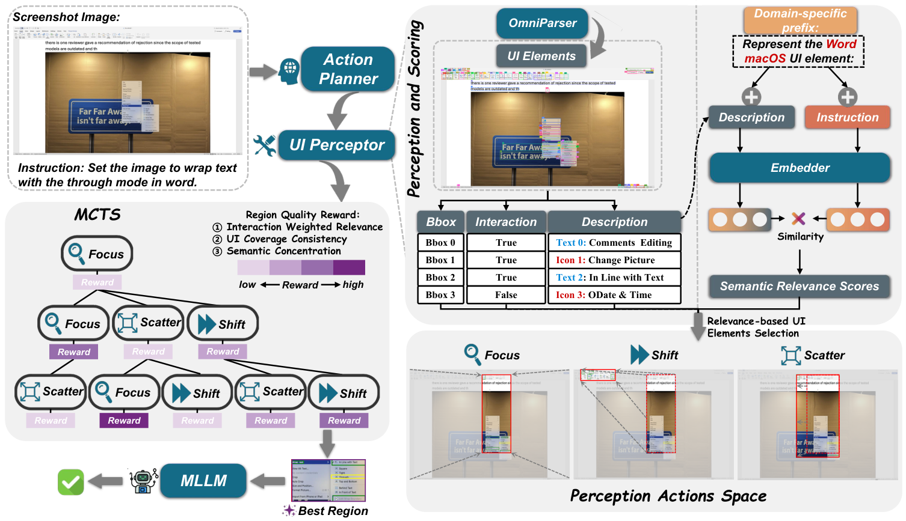

<div align="center">

# DRS-GUI

### Training-free Region Search for GUI Grounding

Find a useful region first. Ground the target within that region.


[](LICENSE.txt)

[Overview](#overview) · [Setup](#setup) · [Models](#models) · [Datasets](#datasets) · [Inference](#single-image-inference) · [Evaluation](#benchmark-evaluation) · [Code](#code-organization)

</div>

## Overview

DRS-GUI is a training-free search layer for screenshot-based GUI grounding. Given a screenshot and an instruction, it parses the interface, explores candidate fields of view, and sends the best region to a grounding model. The predicted click point is then mapped back to the original screenshot.

The implementation brings together three stages:

| Stage | Component | Responsibility |
| :--- | :--- | :--- |
| Perceive | OmniParser V2 + PaddleOCR + INSTRUCTOR | Detect UI elements, read text, caption icons, and score semantic relevance |
| Search | MCTS action planner | Explore candidate regions through Focus, Shift, and Scatter |
| Ground | Qwen2.5-VL or UGround-V1 | Predict the target point from the selected crop |



*Method overview (Figure 2 of the [DRS-GUI paper](https://arxiv.org/abs/2605.15542), CC BY 4.0).*

### Region-search actions

| Action | Field-of-view change | Purpose |
| :--- | :--- | :--- |
| Focus | Contract around relevant elements | Reduce visual distraction |
| Shift | Move to another relevant region | Explore targets outside the current view |
| Scatter | Expand the current view | Recover surrounding context |

The search evaluates regions using relevance, coverage, and concentration. By default it uses **8 simulations** and a **maximum depth of 3**. MCTS does not call the base grounding model during search; coordinate prediction happens after region selection.

### Supported workflows

- Single-image grounding from a screenshot and a natural-language instruction.
- Benchmark evaluation on **ScreenSpot v1**, **ScreenSpot v2**, and **ScreenSpot-Pro**.
- Interchangeable Qwen2.5-VL and UGround-V1 grounding adapters.
- Per-sample predictions, grouped accuracy metrics, and optional search-tree inspection.

## Setup

Requirements: **Python 3.10** and an **NVIDIA GPU with CUDA-enabled PyTorch**.

Run the following from the repository root:

```bash
git clone https://github.com/lyc61c/DRS-GUI.git
cd DRS-GUI

conda create -n drsgui python=3.10 -y
conda activate drsgui

# CUDA 12.1 example; use a PyTorch build compatible with your driver.
pip install torch==2.4.0 torchvision==0.19.0 \
  --index-url https://download.pytorch.org/whl/cu121
pip install -r requirements.txt

python -c "import torch; print(torch.__version__, torch.cuda.is_available())"
```

The CUDA check should print `True`. The dependency versions in `requirements.txt` are based on the project's `gui` environment.

You can inspect either entry point without loading models:

```bash
python drsgui/src/infer.py --help
python drsgui/src/run.py --help
```

## Models

Download the perception components and **at least one** grounding model. The directories below are conventions; existing local model paths also work.

| Component | Source | Suggested local path |
| :--- | :--- | :--- |
| Icon detector and captioner | [OmniParser V2](https://huggingface.co/microsoft/OmniParser-v2.0) | `checkpoints/OmniParser-v2.0/` |
| Caption processor | [Florence-2-base](https://huggingface.co/microsoft/Florence-2-base) | `checkpoints/Florence-2-base/` |
| Semantic encoder | [INSTRUCTOR-large](https://huggingface.co/hkunlp/instructor-large) | `checkpoints/instructor-large/` |
| Grounding option A | [Qwen2.5-VL-7B-Instruct](https://huggingface.co/Qwen/Qwen2.5-VL-7B-Instruct) | `checkpoints/Qwen2.5-VL-7B-Instruct/` |
| Grounding option B | [UGround-V1-7B](https://huggingface.co/osunlp/UGround-V1-7B) | `checkpoints/UGround-V1-7B/` |

<details>
<summary><b>Download commands</b></summary>

```bash
mkdir -p checkpoints

hf download microsoft/OmniParser-v2.0 \
  --include "icon_detect/*" "icon_caption/*" \
  --local-dir checkpoints/OmniParser-v2.0

# Processor, tokenizer, and custom-code files; no extra grounding weights.
hf download microsoft/Florence-2-base \
  --include "*.json" "*.py" "*.txt" \
  --local-dir checkpoints/Florence-2-base

hf download hkunlp/instructor-large \
  --local-dir checkpoints/instructor-large

# Choose one grounding model, or download both for comparison.
hf download Qwen/Qwen2.5-VL-7B-Instruct \
  --local-dir checkpoints/Qwen2.5-VL-7B-Instruct

hf download osunlp/UGround-V1-7B \
  --local-dir checkpoints/UGround-V1-7B
```

</details>

OmniParser's caption directory contains the caption weights; Florence-2-base supplies the processor. Use `--caption-processor` for an explicit local processor path. If omitted, the loader tries the caption directory and then the Florence-2-base cache/Hub. PaddleOCR initializes on the first parsing call and may download its OCR weights.

### Shared model arguments

The inference and evaluation examples below reuse this Bash array. Define it once in the same terminal session:

```bash
MODEL_ARGS=(
  --model-type qwen2_5vl
  --model-path checkpoints/Qwen2.5-VL-7B-Instruct
  --detector-path checkpoints/OmniParser-v2.0/icon_detect/model.pt
  --caption-model checkpoints/OmniParser-v2.0/icon_caption
  --caption-processor checkpoints/Florence-2-base
  --instructor-model checkpoints/instructor-large
)
```

To switch to UGround-V1, replace the first two entries with:

```text
--model-type ugroundv1
--model-path checkpoints/UGround-V1-7B
```

## Datasets

Screenshots and annotations are downloaded separately from the code. This repository does **not** bundle benchmark data.

| Benchmark | Download | `--images` | `--annotations` |
| :--- | :--- | :--- | :--- |
| ScreenSpot v1 | [SeeClick release](https://github.com/njucckevin/SeeClick#gui-grounding-benchmark-screenspot) / [HF mirror](https://huggingface.co/datasets/benwiesel/ScreenSpot) | `data/screenspot_v1/images` | `data/screenspot_v1/annotations` |
| ScreenSpot v2 | [Official release](https://huggingface.co/datasets/OS-Copilot/ScreenSpot-v2) | `data/screenspot_v2/screenspotv2_image` | `data/screenspot_v2` |
| ScreenSpot-Pro | [Official release](https://huggingface.co/datasets/likaixin/ScreenSpot-Pro) | `data/screenspot_pro/images` | `data/screenspot_pro/annotations` |

<details>
<summary><b>Download commands and annotation filenames</b></summary>

```bash
hf download benwiesel/ScreenSpot --repo-type dataset \
  --local-dir data/screenspot_v1

hf download OS-Copilot/ScreenSpot-v2 --repo-type dataset \
  --local-dir data/screenspot_v2
unzip data/screenspot_v2/screenspotv2_image.zip -d data/screenspot_v2

hf download likaixin/ScreenSpot-Pro --repo-type dataset \
  --local-dir data/screenspot_pro
```

ScreenSpot v1 uses `screenspot_desktop.json`, `screenspot_mobile.json`, and `screenspot_web.json`. V2 uses `screenspot_desktop_v2.json`, `screenspot_mobile_v2.json`, and `screenspot_web_v2.json`. Pro has application-specific JSON files in its `annotations/` directory.

The v1 command uses a community mirror. You can instead download the original images and annotations from the SeeClick release and arrange them under the paths in the table.

</details>

`--images` must be the root relative to which each annotation's `img_filename` resolves. The loader supports flat target records and image-level records containing an `annotations` list. V1/v2 boxes are interpreted as `[x, y, width, height]`; Pro boxes as `[x1, y1, x2, y2]`.

<details>
<summary><b>Use custom ScreenSpot-format annotations</b></summary>

Store a JSON array in your annotation directory. For example:

```json
[
  {
    "img_filename": "screenshot.png",
    "instruction": "Click the Settings button",
    "bbox": [100, 50, 160, 90],
    "bbox_format": "xyxy",
    "data_type": "icon",
    "platform": "windows",
    "application": "unknown"
  }
]
```

The bounding box is in original-image pixels. Specify `"bbox_format": "xyxy"` when v1/v2 records have already been converted. Select a custom filename with `--task filename_without_json`. Optional metadata is filled with defaults; missing instructions, images, or malformed boxes are reported before model loading.

</details>

## Single-image inference

After defining `MODEL_ARGS`, provide your own screenshot and instruction:

```bash
CUDA_VISIBLE_DEVICES=0 python drsgui/src/infer.py \
  "${MODEL_ARGS[@]}" \
  --image /path/to/screenshot.png \
  --instruction "Click the Settings button" \
  --platform windows \
  --application unknown \
  --output outputs/prediction.json
```

`--platform` and `--application` are optional semantic hints. The result is printed as JSON and, when `--output` is provided, saved to disk.

The `pred` field is the click point in **original-screenshot pixels**, not crop-relative coordinates. This entry point predicts a location; it does not execute a mouse click.

## Benchmark evaluation

The same pipeline—perception, region search, and final grounding—runs for every benchmark sample.

```bash
# ScreenSpot-Pro
CUDA_VISIBLE_DEVICES=0 bash drsgui/scripts/run_screenspot_pro.sh \
  "${MODEL_ARGS[@]}" \
  --images data/screenspot_pro/images \
  --annotations data/screenspot_pro/annotations \
  --output outputs/qwen2_5vl_screenspot_pro.json
```

<details>
<summary><b>ScreenSpot v1 and v2</b></summary>

```bash
CUDA_VISIBLE_DEVICES=0 bash drsgui/scripts/run_screenspot_v1.sh \
  "${MODEL_ARGS[@]}" \
  --images data/screenspot_v1/images \
  --annotations data/screenspot_v1/annotations \
  --output outputs/qwen2_5vl_screenspot_v1.json

CUDA_VISIBLE_DEVICES=0 bash drsgui/scripts/run_screenspot_v2.sh \
  "${MODEL_ARGS[@]}" \
  --images data/screenspot_v2/screenspotv2_image \
  --annotations data/screenspot_v2 \
  --output outputs/qwen2_5vl_screenspot_v2.json
```

</details>

You can also call `python drsgui/src/run.py --benchmark screenspot_v2 ...` directly. With `--task all`, v1/v2 select their recognized split files when present, avoiding duplicate combined annotations. Pro uses all annotation JSON files in the supplied directory.

### Useful options

| Option | Default | Use |
| :--- | :--- | :--- |
| `--mcts-iterations` | `8` | Search simulations per sample |
| `--max-depth` | `3` | Maximum action-search depth |
| `--seed` | `114514` | Random seed for the runtime |
| `--include-search-tree` | Off | Save structured and readable search trees |
| `--task` | `all` | Evaluation only: one or more comma-separated JSON stems |
| `--num-chunks` / `--chunk-idx` | `1` / `0` | Evaluation only: split the selected samples into independent runs |

For example, append `--task screenspot_web_v2` to the v2 command to select only web samples. To distribute evaluation across GPUs, launch separate processes with different `CUDA_VISIBLE_DEVICES`, chunk indices, and output paths:

```text
GPU 0: --num-chunks 2 --chunk-idx 0 --output outputs/part_0.json
GPU 1: --num-chunks 2 --chunk-idx 1 --output outputs/part_1.json
```

These are independent runs, not distributed model training. Combine their `details` lists and recompute metrics with `screenspot_data.evaluate`; do not average chunk accuracies when chunk sizes differ.

## Outputs and search inspection

Evaluation writes a JSON report containing:

| Field | Content |
| :--- | :--- |
| `details` | Per-sample predictions, original-image regions, model responses, search summaries, and elapsed time |
| `metrics.overall` | Overall, text, and icon accuracy; sample counts; malformed predictions |
| `metrics.fine_grained` | Platform/application-level metric groups |
| `metrics.leaderboard_simple_style` | Group-level metrics |
| `metrics.leaderboard_detailed_style` | Application-level metrics |

A prediction is correct when its point lies inside the annotated target box. Failed samples remain in the metric denominator and retain their grouping metadata.

Each successful sample includes `pred`, `best_region`, `action_history`, `reward_components`, and `search_summary`. The following is an **illustrative subset**, not a benchmark result:

```json
{
  "pred": [1280.0, 720.0],
  "best_region": [1000, 500, 1560, 940],
  "best_region_depth": 2,
  "action_history": ["focus", "shift"]
}
```

Append `--include-search-tree` to either entry point to also save `search_tree` and `search_tree_text`. Tree records contain actions, regions, rewards, and visits; they omit embedded screenshot bytes.

## Code organization

```text
DRS-GUI/
├── README.md
├── requirements.txt
├── LICENSE.txt
├── drsgui/
│   ├── scripts/                      # v1 / v2 / Pro launchers
│   └── src/
│       ├── infer.py                  # single-image CLI
│       ├── run.py                    # evaluation CLI and result collection
│       ├── runtime.py                # shared options, seeds, model initialization
│       ├── model_factory.py          # grounding-model selection
│       ├── screenspot_data.py        # annotation loading and grouped metrics
│       ├── ui_perceptor.py           # UI parsing and semantic ranking
│       ├── utils.py                  # image, coordinate, chunk, JSON helpers
│       ├── models/                   # Qwen2.5-VL / UGround-V1 adapters
│       ├── policies/drsgui/
│       │   ├── mcts.py               # search, rewards, backpropagation, diagnostics
│       │   ├── action.py             # Focus / Shift / Scatter geometry
│       │   ├── instruction_config.py # domain-specific semantic prefixes
│       │   └── policy.py             # shared sample and result interface
│       └── OmniParser/               # retained perception utilities and license
├── checkpoints/                      # local models; not tracked
├── data/                             # local benchmarks; not tracked
└── outputs/                          # generated reports; not tracked
```

For extending the project, start with `model_factory.py` and `models/` for a new grounding backend, `screenspot_data.py` for a new annotation schema, or `policies/drsgui/` for search behavior. Grounding adapters return a normalized crop-relative `point`; the planner handles original-image coordinate mapping.

## Acknowledgements and license

DRS-GUI builds on [OmniParser](https://github.com/microsoft/OmniParser), [INSTRUCTOR](https://github.com/xlang-ai/instructor-embedding), [Qwen2.5-VL](https://github.com/QwenLM/Qwen2.5-VL), and [UGround](https://github.com/OSU-NLP-Group/UGround). We thank the ScreenSpot and ScreenSpot-Pro contributors for their benchmarks.

Project code is released under [Apache 2.0](LICENSE.txt). The retained OmniParser utilities carry their [separate license](drsgui/src/OmniParser/LICENSE). Downloaded model weights and datasets remain governed by their upstream licenses.
